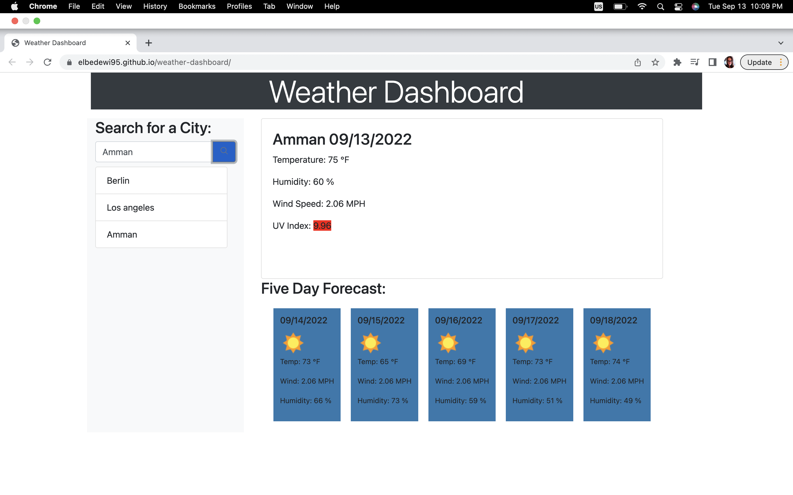

<h1>Weather Dashboard</h1>

Website to retrieve weather information for different cities across the globe.  
Made by Victoria El Bedewi.  
<h2>Technologies Used: </h2>  
1. HTML 
2. CSS  
3. Bootstrap  
4. JavaScript  
5. JQuery  

Git URL: https://github.com/elbedewi95/weather-dashboard  
Live URL: https://elbedewi95.github.io/weather-dashboard/  

 
<h2>Screenshots </h2>

1. Initial screen  
  
2. First Search: Berlin  
  
3. Second Search: Los Angeles  
  
4. Third Search: Amman  
  
5. Fourth Search: San Diego  

